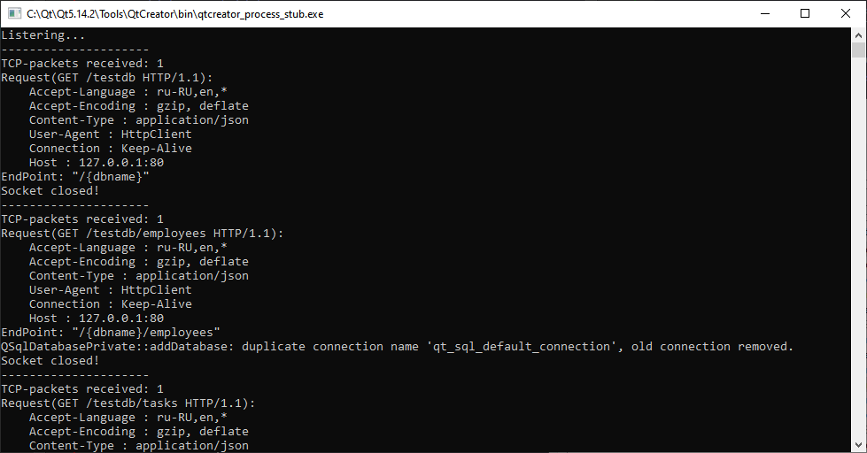

# Трекер задач
Представляет из себя клиент-серверное приложение.

Серверное приложение не имеет графического пользовательского интерфейса, занимается обработкой http-запросов (согласно Rest-API), прослушивает порт 80, и напрямую взаимодействует с PostgresSQL.

