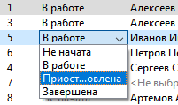
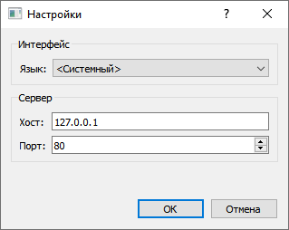
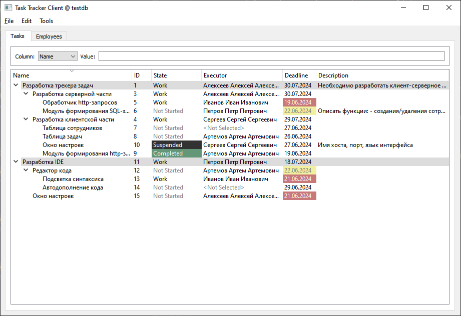

# Трекер задач
Представляет собой клиент-серверное приложение.

## Сервер

Серверное приложение не имеет графического пользовательского интерфейса, занимается обработкой http-запросов (согласно Rest-API), прослушивает порт 80, и напрямую взаимодействует с PostgresSQL.

## Клиент

Стартовое окно клиентского приложения отображает только главное меню, из которого есть возможность создать новую БД, подключиться к уже имеющейся БД либо изменить настройки приложения:

Например, подключаемся к уже существующей БД "testdb". Таблицы сотрудников и задач располагаются на разных одноименных вкладках. Задачи с истекшим сроком выполнения выделяются красным цветом, а задачи, срок выполнения которых заканчивается сегодня, выделяются желтым. Задачи, которые располагаются в корне, и имеют подзадачи подсвечиваются серым цветом.

Задачу можно редактировать двойным щелчком по ней, состояние задачи есть возможность редактировать прямо из таблицы:

Таблица с задачами имеет контекстное меню, которое позволяет создать новую корневую задачу, подзадачу к выделеной, редактировать или удалить выделеную задачу, а также обновить все данные с сервера:

**Внимание! При удалении задачи, удаляются все ее подзадачи! Об этом пользователь еще раз будет уведомлен через сообщение.** 

Сверху располагается фильтр, который может, например, помочь в поиске задачи по ее ID:

Создание и редактирование задачи происходит через отдельное диалоговое окно:

Двойным кликом мыши по ячейке с иполнителем происходит переход к этому сотруднику на вторую вкладку:

Фильтрация, контекстное меню, создание и редактирование сотрудников происходит аналогично вкладке с задачами:

**Внимание! При удалении сотрудника, все задачи, на которые был назначен этот сотрудник исполнителем, станут с неназначенным исполнителем! Об этом пользователь еще раз будет уведомлен через сообщение.**  

Двойным кликом по ячейке задач с истекшим сроком исполнения отображается таблица этих задач, по которым кливнув дважды можно перейти к этой задаче на первой вкладке:

Окно настроек позволяет сменить язык пользовательского интерфейса, а также хост удаленного сервера и порт:

После смены языка на английский:

Ошибки сервера отображаются в отдельном диалоговом окне, например подключение к несуществующей БД:
